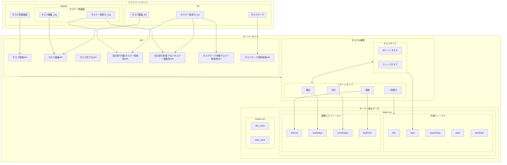

```mermaid

    graph 

        subgraph クライアントサイド
            subgraph list
                subgraph タスクマーク

                end 
                subgraph タスク編集_list

                end
                タスク一覧表示_list
            end

            subgraph register
                subgraph タスク登録画面
                end
                subgraph タスク一覧画面
                    subgraph タスク編集_reg

                    end
                    タスク一覧表示_reg
                end 
            end
        end

        subgraph サーバーサイド
            subgraph API
                タスク登録API
                タスク編集API
                タスク完了化API
                当日実行対象タスク一覧取得API
                当日実行対象でないタスク一覧取得API
                タスクマーク状態タスク一覧取得API
                タスクマーク状態更新API
            end
            subgraph タスクの種類
                subgraph タスクタイプ
                    ポイントタスク
                    ストックタスク
                end
                subgraph リピートタイプ
                    周期
                    曜日
                    日付
                    一回限り
                end
            end
            subgraph サーバー側のデータ
                subgraph tasks.csv
                    subgraph 共通フィールド
                        title
                        type
                        repeatType
                        date
                        startDate
                    end

                    subgraph 種類ごとフィールド
                        interval
                        weekdays
                        monthdays
                        lastDone
                    end

                end 
                subgraph marks.csv
                    title_mark
                    date_mark
                end 
                
            end
        end

    %%クライアントサイド→API
    %%list
    タスク一覧表示_list-->当日実行対象タスク一覧取得API
    タスク一覧表示_list-->当日実行対象でないタスク一覧取得API
    タスク一覧表示_list-->タスクマーク状態タスク一覧取得API
    タスク編集_list-->タスク編集API
    タスクマーク-->タスクマーク状態更新API
    %%register
    タスク登録画面-->タスク登録API
    タスク編集_reg-->タスク編集API
    タスク一覧表示_reg-->当日実行対象タスク一覧取得API
    タスク一覧表示_reg-->当日実行対象でないタスク一覧取得API

    API-->タスクの種類


    タスクタイプ<-->リピートタイプ
    リピートタイプ-->共通フィールド
    周期-->interval
    周期-->lastDone
    曜日-->weekdays
    日付-->monthdays
    タスクタイプ-->type

    %%タスク登録画面-->リピートタイプ
    %%タスク登録画面-->タスクタイプ
    %%タスク編集_reg-->タスクの種類
    %%タスク編集_list-->タスクの種類
    %%タスクマーク-->タスクの種類


    

```